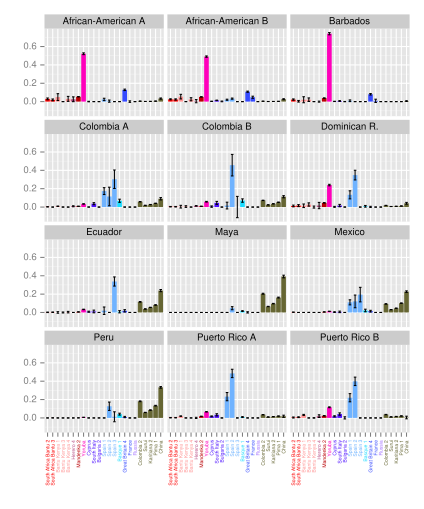

= Population mixture in the Americas

:published_at: 2015-03-31
:hp-tags: population genetics, admixture, americas
:hp-image: ../covers/montinaro_tree.png

Ten thousand years after the first Americans spread into the continent by a northern route from Asia, explorers from western European countries sailed the ocean blue in search of new territories and gold. When they reached the New World the Europeans got to work by first founding villages and towns, and later plantations and colonies, where African slaves were shipped in to perform the hard manual labour required to generate the large quantities of produce that were sent back to Europe in return for cash. Most of the Amerindian descendants who were present then died at the hands of the Europeans, either by the advanced weapons carried by the colonists, or their unfamiliar diseases, but a few have managed to survive through to the present day.

These interactions are well known, and the ancestry of different American groups today is a varied mix of the ancient Amerindian settlers, recent European colonialists, and their African slaves. Most of the slaves that the Europeans brought came from West Africa, although because different European powers had claimed different parts of Africa, some were brought from elsewhere. The Europeans too came from different countries, with Protestant Northern Europeans controlling North America, and the Catholic Iberians staking a claim for most of Middle and South America. Understanding how these different ancestries are represented in the genomes of people today is important from a biomedical perspective, because our genes influence a range of factors, from our predisposition to certain diseases, to the efficacy of certain drugs, 

In a http://www.nature.com/ncomms/2015/150324/ncomms7596/full/ncomms7596.html[recent paper] with colleagues from Oxford, London and Rome, we aimed to address the relative contributions of these three continental ancestries to contemporary American populations with mixed heritage using the very latest statistical genetic techniques. Using publicly available genetic data from a variety of North American African American, Caribbean, Meso and Southern American populations, we employed methods that were able to identify not just the proportion of ancestry from each of the three continental groups - Amerindian, European and African - but were also able to pinpoint where in these continents their ancestors came from.

While the total proportions of the different ancestries varied - for example, there was generally more European and less African ancestry in Southern compared to Northern American groups -  we were able to show that the European ancestry in regions that were historically colonised by the British and French, such as the USA and Barbados, was exclusively Northern European. In contrast, in all groups from American countries colonised by the Spanish, such as Colombia, Peru and Mexico, we identified mostly Iberian ancestry.

Most of the African ancestry can be traced back to a West African group from Nigeria called the Yoruba, which is expected based on the known origins of slaves from this part of Africa. However our fine-scaled approach allowed us to identify small but not insignificant contributions to the Americas from other groups in Africa. In particular, small amounts of ancestry were from groups from  The Gambia, Senegal and East Africa. A clear success of our approach then, was the ability to uncover known geographical variation in the genetic ancestry of people alive in the Americas today.

One of the most striking results was that, in addition to Spanish ancestry, there was a clear signal of Basque ancestry in people from Colombia (figure below). The Basques live on the French/Spanish border, where they speak a language that is completely different from most other European languages, and have long been known to be readily identifiable through their genes. When we looked this up, we found that there was a significant Basque diaspora to Colombia in the 17th century, with reports of around 10% of the European colonists coming from the Basque community. This was a real surprise as it again confirmed that our methods were identifying subtle, but historically accurate, signals in the data.

Looking at how ancestry proportions vary across the Americas allows us to make a guess about the mode of colonisation in different areas. Amerindian ancestry was substantial in Southern but almost absent in Northern American groups, which suggests that there was more interaction and intermarrying with the resident populations in Southern America during the initial contact period. In contrast, Northern and Caribbean populations tended to be a mixture of European and African ancestries only, indicative of interactions between colonialists and slaves. 

While many of these results may sound obvious, it is only recently that researchers have been able to identify the ancestry of contemporary human populations with such precision. Showing that these methods work both in regions of the world where history is well documented, and where the genes of the ancestral groups are well differentiated, as is the case here, helps us to further improve them and, hopefully, will allow us to uncover new insights into human history in parts of the world where the historical record is incomplete or non-existent. 

 
