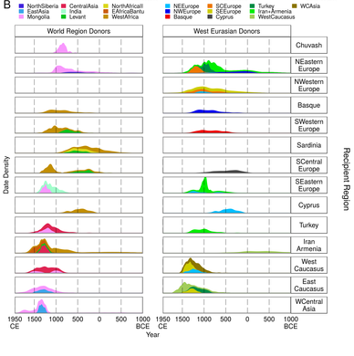

= Using genetics to uncover recent migration and population movements in West Eurasia

:published_at: 2015-10-08
:hp-tags: population genetics, admixture, eurasia
:hp-image: ../covers/helmet_yellow.png

Most of us are familiar with European history. Over the last two thousand years, from the Greeks and Romans through the Medieval Dark Ages to the eventual spread of industrialisation and the beginnings of globalisation, we have sought to chart the development of Western society in an effort to explain where we have come from.

No matter how hard I have tried though, it has always been difficult for me, a scientist living in 21st century Britain, to truly understand these people of myths and legends. How do the people we read about, the Byzantines, Ottomans, Carolingians, Angles, and Saxons relate to the crowds of people walking down Oxford High Street on a warm autumnal day? One way to get a deeper appreciation of these relationships is to look at DNA. In particular, if we can look at how different people from across the world are related to each other, then we can begin to piece together history from a genetic point of view.

Most of the cells in our body carry DNA, which is like a long set of instructions that tells our bodies how to develop and grow. And it's not just our bodies. DNA is used by all life on earth, from the sea spiders that crawl across the bottom of the ocean, to the rhododendrons living high up in the Himalayas, as a way of storing the vital information of how to live on our planet.

Despite the wondrous diversity of life on earth, all of which uses DNA as its information storage system, people look like people and not dogs because the genetic code of humans is almost identical. In fact, any two people's DNA is, on average, 99.99% similar. In its very essence DNA is an exquisitely simple system, made up of just four different chemical bases, which are strung together into long stretches of DNA called chromosomes. The 3 billion bases in the human genome are packaged together into 23 chromosomes, and we have two copies of each, one inherited from each parent.

Although extremely similar, given the enormous size of the human genome, if you know where to look you can focus on the known differences between people and use these differences to explore how related different populations are. We all share DNA with each other, but we share more DNA with particular people because of past interactions between our shared ancestors.

In a http://www.cell.com/current-biology/fulltext/S0960-9822(15)00949-5[recent study], involving colleagues from across Europe, we looked at the DNA of around 1,000 individuals from 50 European and West Asian populations and compared them to a further 1,000 people from around the world. As you might expect, it turns out that West Eurasian people are pretty closely related to each other, so we had to use newly developed statistical techniques to tease out the subtle, but real, genetic relationships between populations.

In particular, rather than just simply adding up the number of differences between two individuals to arrive at an estimate of how closely related they are, we took into account the physical relationship of these differences – or genetic markers – along chromosomes.

Looking at how these genetic markers line up along chromosomes  –  as stretches of DNA that are called haplotypes  – is both a natural and powerful way of thinking about inheritance. During the formation of sperm and eggs – collectively called gametes – our chromosome pairs are split in two, with each parental chromosome being randomly assigned to the resultant gametes. This enforces variation as it means that only about one in every 8 million gametes can have the same set of chromosomes.

Although we inherit one chromosome of each pair from each of our parents, we do not pass these on to our gamates intact. An additional variation-inducing step called _recombination_ occurs during the formation of gametes, such that chunks of our parents' chromosomes are swapped, meaning that no two sets of chromosomes that end up in gametes are the same. The key process of recombination means that over time, chunks of chromosome from different ancestors are scythed together as mosaic records of our ancestral past.

_The figure below shows the timeline of admixture across different part of West Eurasia. For each region (row) we show the timing of the influx of DNA from different parts of the world. The larger the curves, the more admixture that we infer to have happened at that particular time._

When we used this concept of mosaic haplotypes to look at the genes of West Eurasians, we were able to expose the extent to which historical events have shaped the genomes of people alive in today. In particular, we were able to pick up the process of admixture, which is when two or more genetically differentiated groups come together.

Mostly, our results identified known historical migrations and movements. For example we found African haplotypes in Spanish people. Because shorter haplotypes will have undergone more recombination and are therefore older, the length of these haplotypes tells us about when this admixture happened, in the case of the Spanish, we guessed this to be during the period of 750-1000CE.

But this was just one of many results, as we found that admixture was a process that is almost universal across Europe and Western Asia. That is, in most genomes across the continent there is evidence of mixed ancestry. Sometimes these admixture events involved groups from outside of the continent. For example, there is clear evidence of Mongolian-like DNA entering the Caucasus and Turkey, that we were able to date to a small window of history between 1200-1300CE, which aligns almost perfectly with the known expansion of Genghis Khan across Asia. There was also further evidence of small amounts of African admixture across the Mediterranean, in Italy and Greece which we dated to the second half of the first millenium CE.

Perhaps most surprising were events that occurred between groups within Europe. In the UK, for example, we observed a complex admixture event that happened between 500-1200CE involving Germanic, Norwegian and Central European groups, which agrees well with what we know about the movement of Angles, Saxons, and Vikings onto the island. Further to the east, across a number of populations we identified admixture involving groups most similar to modern day Lithuanians. These events centered around 1000CE, highlight a key role for the Slavic expansion in the history of Eastern Europe.

Our research thus highlights that rather than being a time of decline, movements during the Medieval Ages were key to generating the genetic landscape of Europe today. More than anything, however, this work shows that migration and population movement have been the norm rather than the exception throughout our recent history, and that the genomes of everyone tell a story of our past.

_Image credit: the helmet image at the top was generated by Alessandro Corlianò_
